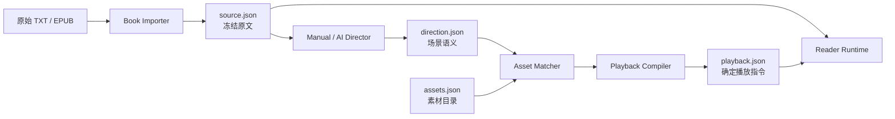

# AI Director + Reader Runtime 执行计划

> 状态：Active
> 最后更新：2026-08-20
> 当前阶段：Phase 4 — 体验闸门进行中
> 下一阶段：Phase 5 — TXT Importer、Matcher 与 Compiler（闸门通过后）

## 1. 项目摘要

本项目要验证一种由原文驱动、由 AI 辅助编排的沉浸式阅读体验。

核心原则只有一句话：

> 原书负责“说什么”，AI 只负责“怎么呈现”。

第一条完整产品链路是：

```text
输入一个 TXT
→ 冻结并编号原文
→ 产生场景导演数据
→ 匹配本地背景、BGM 与环境音
→ 编译为确定的播放清单
→ 在浏览器中逐段阅读
```

项目首先验证阅读体验，再自动化导演过程。手工编排的 Demo 没有通过体验验证前，不接入 AI、EPUB、在线服务或 AI 生图。

## 2. 本文档的用途

本文档用于：

- 约束 MVP 范围，防止过早扩张；
- 明确系统边界和数据所有权；
- 给出每个阶段的具体任务、产物和验收条件；
- 作为后续实现、评审和阶段复盘的唯一执行基线；
- 记录尚未决定但不阻塞当前阶段的问题。

如果实施中需要改变架构或阶段边界，应先修改本文档，再进行对应实现。

## 3. 产品目标与非目标

### 3.1 MVP 目标

使用仓库中的《要求特别多的餐厅》完成一个约 10 分钟的桌面端 Web 阅读 Demo：

- 原文逐段生长，而不是视觉小说式单句替换；
- 场景边界可以触发背景 crossfade；
- 情绪节点可以触发 BGM crossfade；
- 环境音独立于背景和 BGM 切换；
- 用户可通过鼠标、空格和方向键推进；
- 用户可调整字号、音量、动态效果并恢复阅读进度；
- 原文不可被 Director、Matcher 或 Runtime 修改；
- 第一版 Director 数据由人工编写。

### 3.2 第一条自动化闭环目标

手工 Demo 通过体验验证后，实现：

```text
demo.txt
→ source.json
→ direction.json
→ playback.json
→ Reader Runtime
```

其中 `direction.json` 可以由人工或 AI 产生，但后续步骤不关心它来自哪里。

### 3.3 MVP 非目标

以下内容不进入首个体验 Demo：

- EPUB 导入；
- World Compiler 和整本书人物/地点合并；
- AI 图片或音乐生成；
- 人物立绘、配音和视觉小说对话框；
- 后端、数据库、账号、云同步和在线上传；
- 移动端原生应用；
- 多用户素材市场；
- DRM 内容处理；
- 自动发布或素材版权判断。

## 4. 产品假设与验证方式

### 4.1 核心假设

1. 适度的背景、音乐和环境音会提升沉浸感，而不会降低阅读流畅度。
2. “文字向下生长、场景结束后再清屏”比逐句替换更保留阅读感。
3. 背景主要跟随空间、音乐主要跟随情绪、环境音主要跟随环境，会比统一切换更自然。
4. 少量可复用素材加颜色、天气和动效组合，足以支撑首个 Demo。
5. AI 只返回段落 ID 和结构化导演数据，仍能提供足够好的自动编排效果。

### 4.2 最大产品风险

最大风险不是 AI 分场不准，而是这种呈现方式本身比普通阅读更打扰。

因此，AI 接入必须晚于手工 Demo 的体验闸门。

### 4.3 首轮体验验证

建议进行至少 5 次完整阅读观察，可以包含项目作者本人，但至少应有 3 名首次体验者。

记录：

- 是否完整读完；
- 哪些转场让用户分心；
- 用户是否主动关闭音乐或背景动态；
- 用户是否理解推进方式；
- 清屏时机是否打断上下文；
- 用户主观上认为它是“更沉浸”还是“更花哨”；
- 普通阅读模式与沉浸模式的偏好及原因。

体验闸门通过的最低条件：

- 没有阻断完整阅读的交互问题；
- 多数体验者认为至少有一类增强效果有价值；
- 多数体验者不认为转场显著拖慢阅读；
- 可以明确列出应保留、减弱和移除的演出规则；
- 关闭音频和动态效果后仍是可用的阅读器。

这些条件用于决定是否继续自动化，不作为统计学意义上的产品验证。

## 5. 设计原则

### 5.1 原文不可变

- 原始文件按字节保存并计算 SHA-256；
- 导入后产生带 revision 的 `source.json`；
- 原文发生任何变化时生成新 revision，不原地覆盖旧版本；
- Director 只能引用 paragraph ID；
- Director、Matcher 和 Runtime 的数据中禁止复制或改写正文；
- 阅读进度使用 `book_id + revision + paragraph_id` 定位。

### 5.2 语义与演出分离

- Director 描述“发生了什么”；
- Asset Matcher 决定“哪些素材合适”；
- Playback Compiler 决定“何时执行什么效果”；
- Runtime 只执行编译后的确定指令。

### 5.3 三套独立状态机

- Background：优先服从地点，其次是时间和天气；
- Music：优先服从情绪和张力；
- Ambience：优先服从可听见的环境；
- Text：独立管理段落推进、累积和清屏。

### 5.4 克制优先

- 保持一个仍然合适的素材，优先于频繁换成略微更匹配的素材；
- 语义场景变化不自动等于清屏；
- 不为每个 scene 生成或切换图片；
- 不使用未来情节制造“预告式”音乐或画面；
- 用户必须可以关闭声音、背景和动态效果。

### 5.5 本地优先

- 手工 Demo 完全离线工作；
- AI 接入前，所有导入、匹配和播放都在本地完成；
- 未来发送原文到远程模型必须由用户明确启用；
- 原始内容、模型、prompt 和输出缓存之间应有可追踪关系。

## 6. 总体架构



### 6.1 编译时与运行时边界

编译时负责：

- 文本导入、编号和校验；
- 场景分析；
- 素材匹配；
- 转场规划；
- 产生完整、可验证的 `playback.json`。

运行时负责：

- 加载 source 和 playback；
- 预加载当前及下一场景素材；
- 响应推进、后退、菜单和设置操作；
- 执行背景、BGM、环境音转场；
- 保存和恢复进度；
- 在错误时优雅降级到纯文本阅读。

运行时不负责调用模型，也不动态决定素材。

## 7. 核心数据产物

### 7.1 `source.json`

职责：保存不可变的导入结果和原文身份。

建议最小字段：

```json
{
  "schema_version": 1,
  "book_id": "restaurant-of-many-orders",
  "revision": 1,
  "title": "要求特别多的餐厅",
  "language": "zh-CN",
  "source": {
    "format": "txt",
    "path": "source.txt",
    "sha256": "..."
  },
  "paragraphs": [
    {
      "id": "p0001",
      "kind": "title",
      "text": "要求特别多的餐厅"
    },
    {
      "id": "p0002",
      "kind": "prose",
      "text": "两个年轻的绅士……"
    }
  ]
}
```

约束：

- paragraph ID 在同一 revision 内唯一；
- 段落按阅读顺序保存；
- `text` 是源文件中对应文本块的原样内容；
- 任何后续产物只能引用 paragraph ID；
- 生成后视为只读构建产物。

### 7.2 `direction.json`

职责：描述场景语义，不选择具体素材。

建议最小字段：

```json
{
  "schema_version": 1,
  "book_id": "restaurant-of-many-orders",
  "source_revision": 1,
  "source_sha256": "...",
  "scenes": [
    {
      "id": "scene_001",
      "start": "p0002",
      "end": "p0021",
      "location": "mountain_forest",
      "time": "day",
      "weather": "windy",
      "mood": ["uneasy", "cold"],
      "tension": 0.25,
      "background": {
        "tags": ["forest", "mountain", "autumn"]
      },
      "music": {
        "tags": ["minimal", "uneasy"],
        "intensity": 0.2
      },
      "ambience": {
        "tags": ["wind", "leaves"]
      }
    }
  ]
}
```

约束：

- scene 范围必须连续、按顺序且不重叠；
- scene 必须覆盖所有可导演正文，不能无意遗漏；
- paragraph ID 必须存在；
- tension 和 intensity 使用固定范围；
- 不包含正文；
- 不包含具体素材路径；
- 不使用尚未在对应段落揭示的信息。

### 7.3 `assets.json`

职责：声明可用素材、匹配标签、技术属性和授权来源。

```json
{
  "schema_version": 1,
  "assets": [
    {
      "id": "bg_forest_autumn_01",
      "type": "background",
      "path": "backgrounds/forest-autumn-01.webp",
      "tags": ["forest", "mountain", "autumn", "day"],
      "license": "CC0",
      "source": "...",
      "attribution": null
    },
    {
      "id": "amb_wind_leaves_01",
      "type": "ambience",
      "path": "ambience/wind-leaves-01.ogg",
      "tags": ["wind", "leaves", "forest"],
      "loop": true,
      "license": "CC0",
      "source": "...",
      "attribution": null
    }
  ]
}
```

约束：

- asset ID 唯一且路径存在；
- 类型必须与技术元数据匹配；
- 发布前必须具备明确的 license 和 source；
- AI 生成素材未来需额外记录模型、prompt、生成时间和来源策略。

### 7.4 `playback.json`

职责：保存 Matcher 与 Compiler 解析后的最终播放决定。

```json
{
  "schema_version": 1,
  "book_id": "restaurant-of-many-orders",
  "source_revision": 1,
  "cues": [
    {
      "at": "p0002",
      "scene_id": "scene_001",
      "background": {
        "asset_id": "bg_forest_autumn_01",
        "transition": "crossfade",
        "duration_ms": 1600
      },
      "music": {
        "asset_id": "bgm_uneasy_minimal_01",
        "transition": "crossfade",
        "duration_ms": 2400,
        "gain": 0.2
      },
      "ambience": [
        {
          "asset_id": "amb_wind_leaves_01",
          "gain": 0.15
        }
      ],
      "clear_text": false
    }
  ]
}
```

约束：

- cue 按 paragraph 顺序排列；
- cue 引用的 paragraph、scene 和 asset 必须存在；
- Runtime 不需要猜测缺失信息；
- 单个 cue 的切换应是原子操作；
- 无可用素材时允许显式使用 `null`，并降级为纯文本或保留上一状态。

## 8. Playback Compiler 策略

### 8.1 初始匹配权重

背景候选分数：

```text
4 × location_match
+ 2 × time_match
+ 2 × weather_match
+ 1 × mood_match
- 3 × recently_used_penalty
- 5 × unnecessary_change_penalty
```

音乐候选分数：

```text
4 × mood_match
+ 3 × tension_match
+ 1 × scene_type_match
- 4 × recently_used_penalty
- 6 × premature_change_penalty
```

初始版本使用可读、确定的规则，不使用 embedding。

### 8.2 演出预算

Compiler 应支持以下策略参数，具体数值通过手工 Demo 调整：

- 背景最短保持段落数；
- BGM 最短保持时间或段落数；
- 同场景最大视觉切换次数；
- 同一素材的冷却窗口；
- scene 边界是否允许清屏；
- 跨 scene 保持素材的最低匹配阈值；
- 背景、BGM、环境音的默认 crossfade 时长。

语义发生变化不代表必须产生 cue。Compiler 可以选择继续保持当前状态。

## 9. Reader Runtime 交互规格

### 9.1 阅读推进

- 首屏展示书名、开始阅读按钮和音频提示；
- 点击“开始阅读”作为浏览器允许音频播放的首次用户手势；
- 鼠标点击正文空白区域、空格和右方向键显示下一段；
- 左方向键返回上一段；
- 返回操作不得重复触发已完成的 crossfade；
- 进度在新段落稳定显示后写入本地存储；
- 刷新后询问继续阅读或从头开始。

### 9.2 文字布局

- 文字列使用受控最大宽度，避免超长行；
- 新段落淡入并向下累积；
- 当前段落保持清晰，旧段落可以轻微降低强调但不能不可读；
- 文字超出舒适阅读区域时平滑滚动；
- `clear_text` cue 到达时，在新段落出现前完成清屏；
- 清屏和 scene 边界是两个独立概念。

### 9.3 背景

- 双层容器交替实现 crossfade；
- 背景默认暗化和轻微模糊，保证文字对比度；
- 预加载当前背景和下一 cue 背景；
- 素材失败时保持上一背景或使用纯色降级；
- 支持减少动态效果，关闭 zoom/parallax。

### 9.4 音频

- BGM 与 ambience 使用独立音轨和音量；
- 音频切换使用重叠淡入淡出；
- BGM、环境音和总音量分别可调；
- 页面失去焦点时的行为应可配置，MVP 默认继续低音量播放或暂停，评审后确定；
- 用户静音设置持久化；
- 音频加载失败不阻断阅读。

### 9.5 可访问性和降级

- 支持键盘完整操作；
- 控制项具备可读标签和焦点样式；
- 支持 prefers-reduced-motion；
- 字号、行高、背景暗度可调；
- 最低形态始终可以退化成纯文本阅读；
- 不以颜色作为唯一状态提示。

## 10. 建议目录结构

```text
immersive-reader/
├── flake.nix
├── flake.lock
├── .envrc
├── .gitignore
├── justfile
├── package.json
├── pnpm-workspace.yaml
│
├── apps/
│   └── reader/                 # React + TypeScript + Vite
│
├── pipeline/
│   ├── pyproject.toml
│   ├── uv.lock
│   ├── src/
│   │   └── immersive_reader/
│   │       ├── importer/
│   │       ├── director/
│   │       ├── matcher/
│   │       └── compiler/
│   └── tests/
│
├── contracts/
│   ├── source.schema.json
│   ├── direction.schema.json
│   ├── assets.schema.json
│   └── playback.schema.json
│
├── assets/
│   ├── catalog.json
│   ├── backgrounds/
│   ├── music/
│   └── ambience/
│
├── books/
│   └── restaurant-demo/
│       ├── source.txt
│       ├── source.json
│       ├── direction.manual.json
│       └── playback.json
│
├── docs/
│   └── implementation-plan.md
│
└── tests/
    ├── fixtures/
    └── golden/
```

目录将在实施时逐阶段创建，不在 Phase 1 一次性加入空目录。

## 11. 开发环境策略

### 11.1 职责划分

Nix flake 固定系统工具链：

- Node.js LTS；
- pnpm；
- Python；
- uv；
- just；
- jq；
- 可选的 ffmpeg，用于检查和规范化音频素材。

项目依赖由各自生态锁定：

- `flake.lock`：Nix 工具链；
- `pnpm-lock.yaml`：前端依赖；
- `uv.lock`：Python 依赖。

不把全部 npm/Python 依赖直接写进 Nix derivation，以保持 MVP 开发速度。

### 11.2 direnv

`.envrc` 只包含最小入口：

```sh
use flake path:.
```

显式使用 `path:.`，可以让 Nix 在开发期间读取尚未提交的 flake
修改。进入仓库并执行一次 `direnv allow` 后，开发工具自动进入 PATH。

### 11.3 统一命令

计划提供：

```text
just dev             # 启动 Reader 开发服务器
just check           # 汇总格式、类型、lint 和单元测试
just test            # 执行全部测试
just validate        # 校验 JSON 数据与跨文件引用
just compile-demo    # 从 source/direction/assets 编译 playback
```

命令在对应能力实现后再加入，禁止保留无法运行的占位命令。

## 12. 分阶段执行计划

### Phase 0 — 计划评审

目标：确认实施范围和关键默认值。

任务：

- [x] 明确产品核心原则；
- [x] 明确手工 Demo 优先于 AI；
- [x] 确定四层数据产物；
- [x] 确定 flake + direnv；
- [x] 评审本文档；
- [x] 确认第一阶段开始。

完成条件：

- 本文档获准作为实施基线；
- 不阻塞 Phase 1 的待决策项已有默认答案。

### Phase 1 — 可复现环境与最小骨架

目标：任何人在进入仓库后，都能通过同一工具链启动一个最小 React 页面并运行基础检查。

任务：

- [x] 创建 `flake.nix` 和 `flake.lock`；
- [x] 创建 `.envrc` 和必要的 `.gitignore`；
- [x] 在 devShell 中提供 Node、pnpm、Python、uv、just、jq；
- [x] 创建 pnpm workspace；
- [x] 创建 React + TypeScript + Vite 应用 `apps/reader`；
- [x] 创建最小 Python package `pipeline`；
- [x] 加入基础 TypeScript 检查和 Python 测试入口；
- [x] 创建实际可运行的 `just dev` 与 `just check`；
- [x] 在干净 shell 中验证 direnv 激活和所有命令；
- [x] 记录实际选定的工具链版本。

本阶段不做：

- 不导入小说；
- 不实现阅读推进；
- 不引入 Howler；
- 不创建数据 schema；
- 不收集或生成素材。

交付物：

- 可复现的 devShell；
- 能启动的最小网页；
- 能导入的最小 Python package；
- 一条通过的统一检查命令。

验收命令：

```text
direnv allow
just check
just dev
```

完成条件：

- `direnv allow` 后工具版本来自 flake；
- `just check` 退出码为 0；
- Reader 开发服务器正常启动；
- 页面无运行时错误；
- 新环境不依赖全局 npm 或 Python 包。

建议提交：

```text
chore: bootstrap flake development environment
feat: scaffold reader and pipeline workspaces
```

实施结果（2026-08-18）：

```text
Nix       2.33.0 (Determinate Nix 3.15.1)
direnv    2.37.1
Node.js   24.19.0
pnpm      11.21.0
Python    3.13.15
uv        0.12.3
just      1.58.0
jq        1.8.2
Vite      7.3.6
Vitest    3.2.7
pytest    8.4.2
```

验收结果：

- `direnv exec . just versions` 通过；
- `direnv exec . just check` 通过；
- TypeScript 类型检查通过；
- 前端 1 个测试通过；
- Vite 生产构建通过；
- Python package 构建和 1 个 pytest 通过；
- `just dev` 启动成功，并通过本地 HTTP smoke test；
- `nix flake check --no-build` 在当前 aarch64-darwin 平台通过；
- Phase 2、Phase 3 已在后续阶段完成。

### Phase 2 — 数据契约与校验器

目标：先固定系统边界，再开发播放器。

任务：

- [x] 编写四个 JSON Schema；
- [x] 定义 schema version 策略；
- [x] 创建最小合法 fixture；
- [x] 实现单文件 schema 校验；
- [x] 实现跨文件引用校验；
- [x] 校验 scene 无重叠、无倒序、无缺口；
- [x] 校验素材文件存在；
- [x] 校验 source revision 和 hash 一致；
- [x] 将校验接入 `just validate` 和 `just check`；
- [x] 为常见错误提供可定位的错误消息。

交付物：

- `contracts/*.schema.json`；
- validator CLI；
- 合法和非法测试 fixture；
- 数据契约测试。

完成条件：

- 合法 fixture 全部通过；
- 缺失 paragraph、scene 重叠、素材不存在等错误会失败；
- 错误输出包含文件、字段路径和原因；
- Runtime 和 Pipeline 可以共享同一契约定义。

实施结果（2026-08-19）：

- 四份契约采用 JSON Schema Draft 2020-12 和 `schema_version: 1`；
- Director 的背景、音乐、环境音语义使用独立嵌套块；
- Playback cue 省略通道表示保持状态，`null` 表示清除状态；
- validator 同时检查 Schema、SHA-256、source identity、scene 覆盖、cue
  顺序、素材文件、素材引用和素材通道类型；
- `just validate` 可直接校验 bundle；
- 合法、Schema 非法和跨文件非法 fixtures 已加入；
- Python 测试共 15 个，全部通过；
- 完整 `just check` 通过。

### Phase 3 — 手工编排 Demo

目标：在完全没有 AI 的情况下完成可阅读的 10 分钟体验。

任务：

- [x] 将现有 TXT 整理为 demo book；
- [x] 人工产生 `source.json`；
- [x] 将 149 个文本块划分为 7 个语义场景；
- [x] 人工编写 `direction.json`；
- [x] 准备 6 张背景、3 首 BGM 和 2 条环境音；
- [x] 为素材建立带授权和来源信息的 catalog；
- [x] 人工编写首版 `playback.json`；
- [x] 实现 source/playback 加载；
- [x] 实现段落推进、累积、滚动和清屏；
- [x] 实现背景双层 crossfade；
- [x] 引入 Howler 并实现 BGM/ambience 独立状态；
- [x] 实现进度保存和恢复；
- [x] 实现音量、字号和减少动态效果设置；
- [x] 完成键盘操作和纯文本降级。

完成条件：

- 可以从头到尾读完整篇；
- 原文校验无变化；
- 刷新后能恢复到准确段落；
- 背景与 BGM crossfade 无明显中断；
- 素材失败不阻断阅读；
- 常用桌面浏览器中无阻断问题。

实施结果（2026-08-19）：

- 《要求特别多的餐厅》已编译为 149 段不可变正文、7 个导演场景和
  8 个确定播放 cue；
- 6 张项目背景由内置图像生成能力制作，3 首 BGM 和 2 条环境音由仓库
  脚本本地合成，所有素材均记录来源；
- Reader 支持点击、空格、左右方向键、页脚按钮、文字累积、显式清屏、
  进度恢复、设置持久化和纯净阅读；
- 背景以双层 crossfade 切换，BGM 和 ambience 使用 Howler 独立淡入淡出；
- JSON bundle validator、15 个 Python 测试、5 个前端测试、TypeScript
  类型检查和 Vite 生产构建全部通过；
- 在内置浏览器中完成封面、开始阅读、逐段推进、键盘推进、设置面板、
  纯净模式和跨场景背景清理验证，控制台无错误或警告；
- `file://` 直开时会明确提示启动开发服务器，不再呈现无功能空白页。

### Phase 4 — 体验闸门

目标：用观察结果决定演出规则，而不是凭感觉继续堆功能。

任务：

- [x] 设计简短体验记录表；
- [ ] 完成至少 5 次完整阅读观察；
- [ ] 记录推进、清屏、背景、音乐和环境音问题；
- [ ] 调整文字区布局和旧段落强调程度；
- [ ] 调整 crossfade 时长和音量默认值；
- [ ] 确定背景/BGM 的最短保持规则；
- [x] 确定页面失焦时的音频行为；
- [ ] 输出“保留、减弱、移除”结论；
- [ ] 决定是否进入自动化阶段。

完成条件：

- 达到第 4.3 节的体验闸门要求；
- 所有重要反馈都有保留、修复或拒绝理由；
- 演出预算具备可执行默认值。

阶段启动记录（2026-08-20）：

- 已建立 [体验闸门与观察流程](experience-gate.md)；
- 已建立可复制的 [单次体验记录模板](experience-session-template.md)；
- 项目维护者的探索性体验已产生两项改进：底部文字安全区和可跳转阅读历史；
- 项目维护者已完成全文阅读并形成 [SESSION-001](experience-sessions/session-001-owner.md)，
  当前正式观察进度为 1/5，首次体验者进度为 0/3；
- 首次完整观察确认单击逐段推进是高价值核心交互，场景背景带来适度沉浸
  增益；
- 当前音频素材被明确识别为“简单音效而非音乐”，继续正式观察前需补充真实
  且克制的 BGM，音效则保持偶尔出现；该问题已用三首 CC0 旋律/电影配乐
  素材修复，等待后续体验复测；
- 页面失焦时音乐与环境音在 250ms 内降至各自轨道音量的 35%，返回页面时
  平滑恢复且不重置播放状态；
- Phase 5 保持未启动，等待体验样本和演出预算结论。

如果闸门失败：

- 保留 Reader 作为纯文本原型；
- 优先修改交互模型；
- 暂停 AI Director 和素材生成工作。

### Phase 5 — TXT Importer、Matcher 与 Compiler

目标：把手工可用的 Demo 编译流程变成确定、可测试的本地工具链。

任务：

- [ ] 实现 TXT 编码检测或明确编码要求；
- [ ] 定义空行、标题和段落切分规则；
- [ ] 计算原始文件 SHA-256；
- [ ] 生成稳定、可读的 paragraph ID；
- [ ] 生成带 revision 的 `source.json`；
- [ ] 实现标签标准化；
- [ ] 实现背景、音乐、环境音独立评分；
- [ ] 实现 recent-use 和 unnecessary-change penalty；
- [ ] 实现演出预算和保持策略；
- [ ] 产生确定的 `playback.json`；
- [ ] 使用手工 Demo 建立 golden tests；
- [ ] 输出匹配解释，便于调试每次选择。

完成条件：

- 相同输入和配置产生字节级稳定的结构化结果；
- 导入结果可以追溯到原始文件 hash；
- Matcher 不调用模型也可工作；
- 输出能说明候选分数和最终选择原因；
- golden tests 能发现非预期演出变化。

### Phase 6 — AI Scene Director

目标：用 AI 代替人工生成 `direction.json`，不改变后续组件。

任务：

- [ ] 定义 provider-neutral Director 接口；
- [ ] 建立严格结构化输出 schema；
- [ ] 以 paragraph ID 和原文块作为输入；
- [ ] 实现带前后 overlap 的分块；
- [ ] 实现 chunk 边界场景合并；
- [ ] 校验无遗漏、无重叠和合法标签；
- [ ] 限制未来信息泄露和提前剧透；
- [ ] 按 source hash、模型、prompt、schema 版本缓存；
- [ ] 失败时有限重试并保留人工回退；
- [ ] 建立人工版 direction 作为评估基准；
- [ ] 输出 scene 边界差异、标签差异和预期 cue 数量；
- [ ] 提供人工审阅和局部覆盖机制。

完成条件：

- AI 输出不含改写正文；
- 所有引用均能通过 validator；
- chunk 边界不会产生明显重复 scene；
- 对 Demo 的场景边界和演出密度达到可接受水平；
- 模型失败时仍可继续使用人工 direction；
- 替换 AI provider 不影响 Matcher 和 Runtime。

### Phase 7 — World Compiler

进入条件：至少有一章通过 AI Director 稳定编译，并确认跨章节一致性已经成为实际问题。

目标：为整本书建立规范化人物、地点和时间线。

重点：

- 章节摘要；
- Character Bible；
- Location Bible；
- Story/Timeline Bible；
- 别名合并；
- 已有 location ID 优先；
- 上一章状态传递；
- 新实体的受控创建；
- Bible revision 和人工修订。

### Phase 8 — EPUB 与生成式素材

EPUB：

- 解析 spine 顺序和 XHTML 块级内容；
- 映射为统一 `source.json`；
- 保留章节与原 EPUB 定位信息；
- 复杂排版可考虑 epub.js fallback，但不让两套 Runtime 成为默认架构。

AI 素材：

- 只在素材库没有合适候选时生成；
- 先创建 book-local world asset library；
- 相同地点优先复用；
- 记录模型、prompt、版本和生成来源；
- 人物视觉和可能剧透的场景不自动生成；
- 生成失败时回退到已有素材或纯色背景。

## 13. 测试策略

### 13.1 数据契约测试

- JSON Schema 合法性；
- paragraph/scene/asset 跨引用；
- scene 顺序、覆盖和边界；
- source revision/hash 一致性；
- cue 顺序和演出预算；
- 禁止在 direction/playback 复制正文。

### 13.2 Pipeline 单元测试

- TXT 分段；
- ID 生成；
- 标签标准化；
- 匹配打分；
- penalty 和保持策略；
- cue 合并；
- 相同输入的确定性。

### 13.3 Golden tests

对固定的 source、direction 和 asset catalog 保存预期 playback。算法调整时必须显式审阅差异，避免出现测试仍通过但演出密度已经大幅变化的情况。

### 13.4 Runtime 单元与组件测试

- paragraph reducer；
- scene/cue 定位；
- 进度恢复；
- 设置持久化；
- 背景状态机；
- 音频状态机；
- 素材失败降级。

### 13.5 端到端测试

- 首次开始阅读；
- 连续推进若干段；
- 到达 scene cue；
- 刷新并恢复；
- 静音和减少动态效果；
- 素材 404 时继续阅读；
- 键盘完整操作；
- 完整 Demo smoke test。

音频在自动化测试中验证状态和调用顺序，实际听感仍通过人工体验测试判断。

## 14. 可观测性与调试

MVP 不引入远程监控，但开发模式需要可解释：

- 当前 paragraph ID；
- 当前 scene ID；
- 当前 background/music/ambience asset ID；
- 最近一次 cue；
- Matcher 候选分数和 penalty；
- 素材加载错误；
- source/direction/playback 版本信息。

调试信息只在开发模式显示，不能遮挡正式阅读界面。

## 15. 风险登记

| 风险 | 影响 | 首要缓解措施 |
|---|---|---|
| 演出比阅读更抢注意力 | 产品方向失败 | 手工 Demo 和体验闸门优先 |
| AI 改写或遗漏原文 | 破坏核心原则 | 原文冻结、ID 引用、正文复制检测 |
| AI 提前剧透 | 严重破坏体验 | knowledge boundary 规则与人工评估 |
| 场景切换过于频繁 | 体验像 MV | change penalty 和演出预算 |
| 浏览器阻止自动播放 | 首次无声音 | 明确的开始阅读用户手势 |
| 素材授权不清 | 无法发布 | catalog 强制 license/source |
| 音频和图片加载失败 | 中断阅读 | 预加载、超时和纯文本降级 |
| paragraph ID 因文本修改漂移 | 进度和导演数据失效 | source revision + SHA-256 |
| EPUB 结构复杂 | 导入不完整 | 后置、fixture 测试、保留定位信息 |
| World Bible 产生错误合并 | 全书视觉错误 | revision、人工覆盖和受控新实体 |
| Nix 与应用依赖耦合过深 | 开发变慢 | Nix 固定工具，生态 lock 固定依赖 |

## 16. 待决策项与建议默认值

这些问题不阻塞 Phase 1。

| 问题 | 建议默认值 | 最晚决定阶段 |
|---|---|---|
| 页面失焦后音频行为 | 自动降低音量，暂不停止 | Phase 4 |
| 是否允许点击正文任意位置推进 | 允许，但控制区点击不推进 | Phase 3 |
| 返回上一段是否恢复历史素材状态 | 先只回退文字，不重演 crossfade | Phase 3 |
| 场景边界是否默认清屏 | 默认否，由 playback 显式指定 | Phase 3 |
| BGM 是否默认开启 | 开启，但首屏明确提示且音量较低 | Phase 3 |
| 是否提供“纯净阅读模式” | 提供，一键关闭全部演出 | Phase 3 |
| AI provider | 保持接口中立，接入阶段再选 | Phase 6 |
| EPUB 解析实现 | 优先统一导入，epub.js 仅作备选 | Phase 8 |

## 17. 阶段完成定义

任一阶段只有同时满足以下条件才算完成：

- 该阶段列出的交付物已经存在；
- 对应自动化检查通过；
- 没有用占位实现伪造成功路径；
- 文档与实际命令、目录和行为一致；
- 新增决策已记录；
- 已说明已知限制；
- 用户完成阶段验收。

## 18. 当前下一步

Phase 4 已启动。按照 [体验闸门](experience-gate.md) 完成至少 5 次完整阅读
观察，其中至少 3 名首次体验者。每轮反馈必须落实为修复、保留、拒绝或继续
观察的明确决定。

闸门通过后进入 Phase 5，将已经验证过的演出规则实现为确定、可测试的 TXT
Importer、Asset Matcher 和 Playback Compiler。
